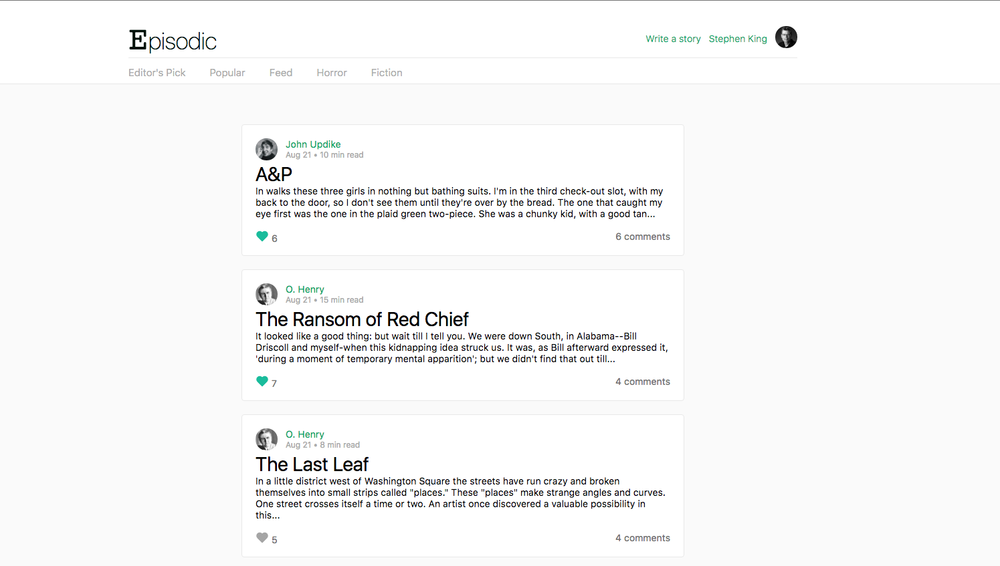

# Episodic

[live][heroku]

[heroku]: http://www.episodic.space/



Episodic is a full-stack web application inspired by Medium.  It utilizes Ruby on Rails on the backend, a PostgreSQL database, and React.js with a Flux architectural framework on the frontend. Episodic was built as a single-page application.

## Features & Implementation

- Account creation
- Create and Edit Stories with rich inline text-editor
- Follow other users
- Like stories
- Comment on stories
- User Profile
  - keep tracks of stories, comments, and likes.
  - manage followings and followers
- Feed page

## Technical Details

Since user can access majority of Episodic's content without being logged-in, buttons were isolated as it's own component. The button component will decide how it will render based on current log-in status (`SessionStore#isUserLoggedIn`). Buttons such as the Follow button will also check if current user is following the viewed user.

```javascript
  render () {
    let followButton;
    if (SessionStore.isUserLoggedIn()) {
      if (this.props.isFollowing) {
        followButton = (
          <button className="following-button" onClick={this.handleUnfollow}> Following </button>
        );
      } else {
        followButton = (
          <button className="follow-button" onClick={this.handleFollow}> Follow </button>
        );
      }
    } else {
      followButton = (
        <div className="follow-button-special">
          <SessionButton name={"Follow"} />
        </div>
      );
    }

    return (
      <div className="user-view-following-status">
        {followButton}
      </div>
    );
  }
```

## Libraries

- [jQuery](http://jquery.com)
- [Flux](https://facebook.github.io/flux)
- [React router](https://github.com/rackt/react-router)
- [bcrypt](https://github.com/codahale/bcrypt-ruby)
- [paperclip](https://github.com/thoughtbot/paperclip)
- [jbuilder](https://github.com/rails/jbuilder)
- [AWS SDK](https://github.com/aws/aws-sdk-rails)
- [Medium Editor](https://yabwe.github.io/medium-editor/)
- [React-avatar](https://www.npmjs.com/package/react-avatar)


## Future Features

In addition to the features already implemented, I plan to continue work on this project.  The next steps for Episodic are outlined below.

- [ ] Sign up/Log with twitter or FB
- [ ] Richer story creation and editing with MediumEditor image add-on
- [ ] Tag stories with multiple tags and search stories by tag
- [ ] Bookmark stories
- [ ] Pagination / infinite scroll
- [ ] Receive notifications when people/pubs you follow post new content
- [ ] Allow highlights, denote top highlighted sections
